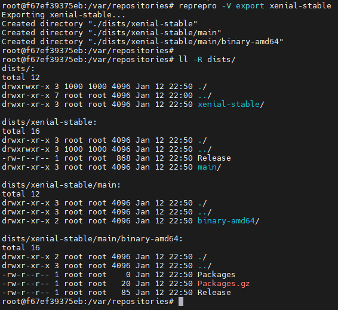
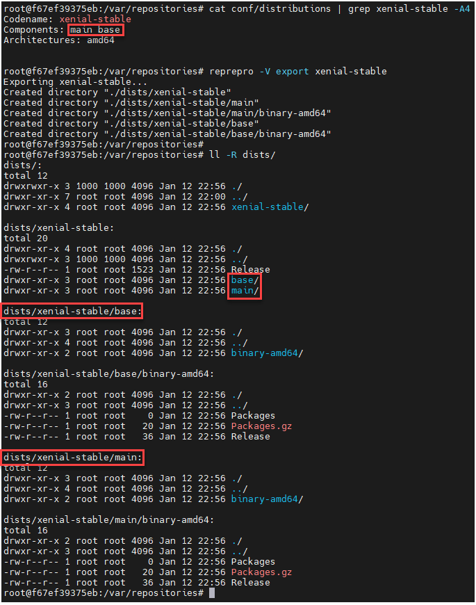
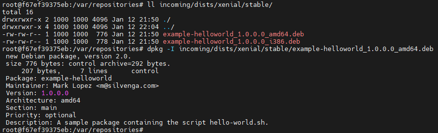
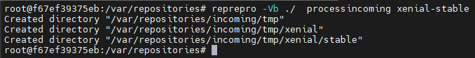
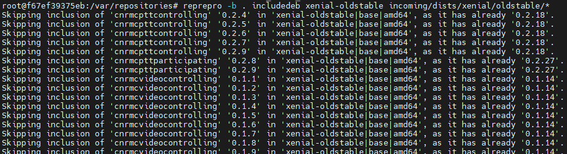

# reprepro

https://wikitech.wikimedia.org/wiki/Reprepro

https://docs.debops.org/en/latest/ansible/roles/reprepro/defaults-detailed.html

https://www.porcheron.info/setup-your-debianubuntu-repository-with-reprepro/

https://manpages.debian.org/unstable/reprepro/reprepro.1.en.html


## nginx İle Açık DEBIAN Paket Havuzuna Dönüştürelim

`/etc/nginx/sites-available/default` dosyasının içeriğini aşağıdaki gibi yapalım:

```
server {

        ## Let your repository be the root directory
        root            /var/repositories;

        ## Always good to log
        access_log      /var/log/nginx/repo.access.log;
        error_log       /var/log/nginx/repo.error.log;

        ## Prevent access to Reprepro's files
        location ~ /(db|conf) {
                deny            all;
                return          404;
        }
}
```

## Komutlar

### export

`export` ile `conf/[incoming|distrubutions...]` dosyaları içinde tanımlı dizinleri oluşturuyoruz

```
reprepro -Vb /var/repositories/ export
```

`-V` ile `verbose` çıktı

`-b /var/repositories` ile `basedir` olarak `/var/repositories` dizininde çalışmasını söylüyoruz. Böylece `--basedir` veya `-b` ile belirtilen dizinde `conf/[incoming|distrubutions...]` dosyalarını arıyor.


Aynı sonucu zaten reprepro'nun kök dizini olarak başlatacağımız (göreceli olarak conf/[distrubutions|incoming|options..] dosyalarının olduğu) dizinde ve fazladan ekran çıktısı istemeden çalıştırırsak sonucun aynı olduğunu görürüz (`reprepro export`):


Sadece distrubutions içinde bir tanım için çalıştırmak istersek komut ve sonuç şöyle olacak:

```
reprepro -V export xenial-stable
```




Bu kez xenial-stable içinde birden fazla Components olsun (main ve base). export ile yarattığımızda bu iki bileşen için dizin oluşturulacak:




### list

```
$ reprepro list xenial-stable
$ reprepro list xenial-unstable
```


### processincoming

incoming/dists/xenial/stable dizininde yer alan deb dosyaları hem amd64 hem i386 mimarisinde olacak şekilde iki tanedir.




`# reprepro -Vb ./ processincoming xenial-stable` komutuyla deb dosyalarını tarıyor ve dizinlere yerleştiriyoruz. Bunun için komut `xenial-stable` adında `conf/incoming` dosyasında tanımlı bir aktarım var mı diye bakıyor. Oradaki tanıma göre geçici dizini yaratıyor




### includedeb İle Paketleri Almak

Dizin içindeki paketleri içeri almak için:

```
reprepro -b . includedeb xenial-oldstable incoming/dists/xenial/oldstable/*
```




### Genel Komutlar

https://www.learn-codes.net/php/can-reprepro-accept-a-new-version-of-a-package-into-the-repository/

```
 sudo -i reprepro <etc..etc>
```

```
 sudo -i private_reprepro <etc..etc>
```

```
reprepro ls PACKAGE_NAME
```

```
# reprepro ls puppet
puppet | 4.8.2-5~trusty1 |  trusty-wikimedia | amd64, i386, source
puppet |  4.8.2-5~bpo8+1 |  jessie-wikimedia | amd64, i386, source
puppet |  3.8.5-2~bpo8+2 |  jessie-wikimedia | amd64, i386, source
puppet |         4.8.2-5 | stretch-wikimedia | amd64, i386, source
```

```
reprepro list DISTRIBUTION_NAME
```

```
reprepro -C <COMPONENT_NAME> list <DISTRIBUTION_NAME> [<PACKAGE_NAME>]
```

```
reprepro -C main list buster-wikimedia varnish-modules
```

```
reprepro -C component/redis2 list buster-wikimedia
```

```
reprepro dumpreferences
```

```
user@apt1001:~ $ sudo -i reprepro processincoming default
```

```
user@apt1001:~ $ sudo -i reprepro export
```

```
# reprepro -C COMPONENT include DISTRIBUTION CHANGES_FILE
```

```
# reprepro -C main include stretch-wikimedia nagios-nrpe-server_3.0.1-3+deb9u1+wmf1_amd64.changes
```

```
# reprepro -C universe includedsc lucid-wikimedia varnish_2.1.2-1.dsc
# reprepro -C universe includedeb lucid-wikimedia varnish_2.1.2-1_amd64.deb
# reprepro -C universe includedeb lucid-wikimedia libvarnish1_2.1.2-1_amd64.deb
# reprepro -C universe includedeb lucid-wikimedia libvarnish-dev_2.1.2-1_amd64.deb
```

```
# reprepro remove distribution-name package-name
```

```
# reprepro remove jessie-wikimedia facter
```

```
# reprepro removesrc distribution-name package-name
```

```
# reprepro removesrc trusty-wikimedia openjdk-8
```

```
# reprepro -C thirdparty/elastic65 remove stretch-wikimedia kibana
```

```
root@apt1001:/srv/wikimedia# reprepro clearvanished 
There are still packages in 'buster-wikimedia|thirdparty/amd-rocm25|amd64', not removing (give --delete to do so)!
Deleting vanished identifier 'buster-wikimedia|thirdparty/amd-rocm25|i386'.
Deleting vanished identifier 'buster-wikimedia|thirdparty/amd-rocm25|source'.
```

```
root@apt1001:/srv/wikimedia# reprepro --delete clearvanished 
Deleting vanished identifier 'buster-wikimedia|thirdparty/amd-rocm25|amd64'.
Deleting files no longer referenced...
```

```
# packagename	fieldname	newvalue
```

```
varnish		Distribution	lucid
libvarnish1	Distribution	lucid
libvarnish-dev	Distribution	lucid
```

```
# reprepro [-C component/...] copy buster-wikimedia stretch-wikimedia prometheus-rsyslog-exporter
Exporting indices...
# reprepro ls prometheus-rsyslog-exporter
prometheus-rsyslog-exporter | 0.0.0+git20180118-1 |  jessie-wikimedia | amd64, source
prometheus-rsyslog-exporter | 0.0.0+git20180118-1 | stretch-wikimedia | amd64, source
prometheus-rsyslog-exporter | 0.0.0+git20180118-1 |  buster-wikimedia | amd64, source
```

```
user@apt1001:~ $ sudo find /srv/wikimedia/ -name *python-mwclient*
/srv/wikimedia/pool/thirdparty/m/mwclient/python-mwclient_0.8.4-1_all.deb

user@apt1001:~ $ sudo -i reprepro -C <new_component> includedeb <new_repo> /srv/wikimedia/pool/thirdparty/m/mwclient/python-mwclient_0.8.4-1_all.deb
```

```
  # reprepro --component thirdparty/tor checkupdate stretch-wikimedia
Calculating packages to get...
Updates needed for 'stretch-wikimedia|thirdparty/tor|source':
'tor': '0.3.3.9-1~d90.stretch+1' will be upgraded to '0.3.5.7-1~d90.stretch+1' (from 'tor-stretch'):
 files needed: pool/thirdparty/tor/t/tor/tor_0.3.5.7-1~d90.stretch+1.dsc pool/thirdparty/tor/t/tor/tor_0.3.5.7.orig.tar.gz pool/thirdparty/tor/t/tor/tor_0.3.5.7-1~d90.stretch+1.diff.gz
 Updates needed for 'stretch-wikimedia|thirdparty/tor|amd64':
'tor': '0.3.3.9-1~d90.stretch+1' will be upgraded to '0.3.5.7-1~d90.stretch+1' (from 'tor-stretch'):
 files needed: pool/thirdparty/tor/t/tor/tor_0.3.5.7-1~d90.stretch+1_amd64.deb
'tor-dbgsym': '0.3.3.9-1~d90.stretch+1' will be upgraded to '0.3.5.7-1~d90.stretch+1' (from 'tor-stretch'):
 files needed: pool/thirdparty/tor/t/tor/tor-dbgsym_0.3.5.7-1~d90.stretch+1_amd64.deb
'tor-geoipdb': '0.3.3.9-1~d90.stretch+1' will be upgraded to '0.3.5.7-1~d90.stretch+1' (from 'tor-stretch'):
 files needed: pool/thirdparty/tor/t/tor/tor-geoipdb_0.3.5.7-1~d90.stretch+1_all.deb
```

```
reprepro checkupdate stretch-wikimedia
```

```
reprepro  --noskipold --restrict grafana checkupdate
```

```
 # reprepro --noskipold  --component thirdparty/php72 update stretch-wikimedia
Calculating packages to get...
Getting packages...
Installing (and possibly deleting) packages...
Exporting indices...
Deleting files no longer referenced...
```

```
$ sudo -E reprepro --verbose --component  thirdparty/gitlab update buster-wikimedia 
.....snip.....
aptmethod redirects 'https://packages.gitlab.com/gitlab/gitlab-ce/debian/dists/buster/main/binary-amd64/Packages.bz2' to 'https://d20rj4el6vkp4c.cloudfront.net/7/8/debian/dists/buster/main/binary-amd64/Packages.bz2?t=1618409760_6b07d0289d193c0fe2b28b704d6a5efe45eeb096'
aptmethod got 'https://d20rj4el6vkp4c.cloudfront.net/7/8/debian/dists/buster/main/binary-amd64/Packages.bz2?t=1618409760_6b07d0289d193c0fe2b28b704d6a5efe45eeb096'
Calculating packages to get...
Getting packages...
aptmethod redirects 'https://packages.gitlab.com/gitlab/gitlab-ce/debian/pool/buster/main/g/gitlab-ce/gitlab-ce_13.10.3-ce.0_amd64.deb' to 'https://d20rj4el6vkp4c.cloudfront.net/7/8/debian/package_files/97310.deb?t=1618409761_57fc9bd551c3fae0715cb4ab072ac304dcdf8d4b'
aptmethod got 'https://d20rj4el6vkp4c.cloudfront.net/7/8/debian/package_files/97310.deb?t=1618409761_57fc9bd551c3fae0715cb4ab072ac304dcdf8d4b'
```

```
Error: gpgme created no signature!
This most likely means gpg is confused or produces some error libgpgme is
not able to understand.
```

```
sudo -i
```

```
export REPREPRO_BASE_DIR=/srv/wikimedia
export GNUPGHOME=/root/.gnupg
sudo -E ...
```

```
 16 # set the right base dir for reprepro, depending whether it's apt.wm.org or releases.wm.org
 17 if [ "$(hostname -s | cut -c 1-8)" == "releases" ]; then
 18     export REPREPRO_BASE_DIR=/srv/org/wikimedia/reprepro
 19 fi
 20 if [ "$(hostname -s | cut -c 1-3)" == "apt" ]; then
 21     export REPREPRO_BASE_DIR=/srv/wikimedia
 22 fi
```

```
[wmf]
fqdn = apt1001.wikimedia.org
login = myuser
incoming = /srv/wikimedia/incoming
method = scp
```

```
user@laptop:~/pkg$ dput -c ~/dput.wmf.cf wmf ../pyasn1_0.4.2-3~bpo9+1~wmf1_amd64.changes 
Checking signature on .changes
gpg: ../pyasn1_0.4.2-3~bpo9+1~wmf1_amd64.changes: Valid signature from 68E713981D1515F8
Uploading to wmf (via scp to apt1001.wikimedia.org):
pyasn1_0.4.2-3~bpo9+1~wmf1_amd64.buildinfo                                                                100% 8146    67.9KB/s   00:00  
pypy-pyasn1_0.4.2-3~bpo9+1~wmf1_all.deb                                                                   100%   56KB 137.4KB/s   00:00  
python-pyasn1-doc_0.4.2-3~bpo9+1~wmf1_all.deb                                                             100%  112KB 181.5KB/s   00:00  
python-pyasn1_0.4.2-3~bpo9+1~wmf1_all.deb                                                                 100%   56KB  93.2KB/s   00:00  
python3-pyasn1_0.4.2-3~bpo9+1~wmf1_all.deb                                                                100%   56KB 137.7KB/s   00:00  
pyasn1_0.4.2-3~bpo9+1~wmf1_amd64.changes                                                                  100% 3166    15.0KB/s   00:00  
Successfully uploaded packages.
```

```
[...]
$cfg{'wmf'} = {
    fqdn => 'apt1001.wikimedia.org',
    method => 'scp',
    incoming => '/srv/wikimedia/incoming',
    login => 'yourusername',
};
[...]
```

```
$ dupload --to wmf ../pkg_version_amd64.changes
```

```
user@debian:~$ wget https://packages.cloud.google.com/apt/dists/kubernetes-xenial/main/binary-amd64/Packages
[..]
user@debian:~$ grep-dctrl \( -P 'kubeadm' -o -P 'kubelet' -o -P 'kubectl' -a -FVersion --lt 1.16 -a -FVersion --ge 1.15 \) -o \( -P 'kubernetes-cni' -o  -P 'cri-tools' \) < Packages | less
[..]
```


# freight

https://github.com/rcrowley/freight
