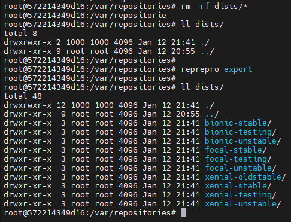

# reprepro

https://wikitech.wikimedia.org/wiki/Reprepro

https://docs.debops.org/en/latest/ansible/roles/reprepro/defaults-detailed.html

https://www.porcheron.info/setup-your-debianubuntu-repository-with-reprepro/


## nginx İle Açık DEBIAN Paket Havuzuna Dönüştürelim

`/etc/nginx/sites-available/default` dosyasının içeriğini aşağıdaki gibi yapalım:

```
server {

        ## Let your repository be the root directory
        root            /var/repositories;

        ## Always good to log
        access_log      /var/log/nginx/repo.access.log;
        error_log       /var/log/nginx/repo.error.log;

        ## Prevent access to Reprepro's files
        location ~ /(db|conf) {
                deny            all;
                return          404;
        }
}
```

## Komutlar

### export

`export` ile `conf/[incoming|distrubutions...]` dosyaları içinde tanımlı dizinleri oluşturuyoruz

```
reprepro -Vb /var/repositories/ export
```

`-V` ile `verbose` çıktı

`-b /var/repositories` ile `basedir` olarak `/var/repositories` dizininde çalışmasını söylüyoruz. Böylece `--basedir` veya `-b` ile belirtilen dizinde `conf/[incoming|distrubutions...]` dosyalarını arıyor.


Aynı sonucu zaten reprepro'nun kök dizini olarak başlatacağımız (göreceli olarak conf/[distrubutions|incoming|options..] dosyalarının olduğu) dizinde ve fazladan ekran çıktısı istemeden çalıştırırsak sonucun aynı olduğunu görürüz (`reprepro export`):




### list

```
$ reprepro list xenial-stable
$ reprepro list xenial-unstable
```


# freight

https://github.com/rcrowley/freight
